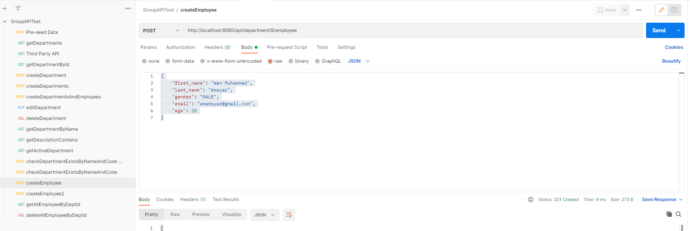

# Spring Boot Backend Project

Spring Boot 3.2.0,
Maven,
Java 17

## Dependency
- spring framework
- mssql-jdbc
- lombok
- hibernate/jpa
- modelmapper

## List of APIs:
- Get - /api/department?pageNo=0&pageSize=10&sortBy=id
- Get - /api/department/thirdPartyApi
- Get - /api/department/{deptId}
- Post - /api/department | **ReqBody - `DepartmentDto`**
- Post - /api/department/creates | **ReqBody - `List<DepartmentDto>`**
- Post - /api/department/create/departmentAndEmployee **ReqBody - `DepartmentAndEmployeesDto`**
- Put - /api/department/{deptId} **ReqBody - `DepartmentDto`**
- Delete - /api/department/{deptId}
- Get - /api/department?name=third department
- Get - /api/department?description=support engineer
- Get - /api/department/active
- Post - /api/department/exist **ReqBody - `DepartmentDto`**
- Post -  /api/department/{deptId}/employee **ReqBody - `EmployeeDto`**
- Get - /api/department/{deptId}/employee
- Delete - /api/department/{deptId}/employee

## Postman API List

